  
  
  
  

  

---

## whoami

Pre-final-year at **IIT Kharagpur** — B.Tech (Hons.) Aerospace Engineering with **minors in Artificial Intelligence and Computer Science**.

I work the boring, load-bearing parts of a product: the migration history, the deploy pipeline, the money path, the thing that pages someone at 3 AM. Most of what I ship is **backend and platform** — Python/Django and TypeScript/Node services on AWS — but I take features end to end, from the Postgres schema up through the React the user actually touches.

Two things I care about, visible in everything below: **correctness before cleverness** (idempotent writes, atomic transactions, audit trails, drift caught in CI) and **owning the whole slice** rather than throwing a PR over the wall.

> **A note on the graph below.** Most of my work lives in private organisation repos — SigIQ.ai, Zlice, Urvann. GitHub's contribution calendar hides those by default, so the green squares undercount reality by a wide margin. The **308 merged pull requests across 23 repositories and 11 organisations** is the number that actually reflects the work.

---

## Experience

###  &nbsp;Software Engineering Intern · *May – Jul 2026*

Building AI for education — two products, **PadhAI** (UPSC exam prep, subscriptions) and **EverTutor** (live AI tutoring).
**155 commits · 35 PRs · 6 repositories · ~1,800 files touched.**

<table>
<tr><td width="34%"><b>Database unification</b></td><td>
<code>ai-tutor</code> and <code>et-studio</code> had drifted into <b>two conflicting Alembic histories</b>, blocking a shared database. I reconstructed the first revision from git history, merged both into <b>one linear lineage</b>, and retired <b>~3,900 lines</b> of stale migrations. Proved zero drift by rebuilding a scaffold DB and confirming <code>autogenerate</code> produced an empty revision.
</td></tr>
<tr><td><b>CI guardrails + auto-migrate</b></td><td>
Five blocking checks on every migration PR — readable filenames, <b>single head</b>, applies clean, reversible, and <b>no drift</b> vs the ORM. Added a pre-deploy <code>db_migrate</code> container so schema and code ship together instead of by hand.
</td></tr>
<tr><td><b>Backend unification</b></td><td>
Folded the et-studio backend into the ai-tutor monorepo — <b>77 files</b> migrated off a duplicated <code>backend.core</code> onto shared config / secrets / logging, with all CloudWatch metrics unified behind one <code>MetricRecorder</code>.
</td></tr>
<tr><td><b>Frontend unification</b></td><td>
Relocated the entire ET-Studio web frontend — <b>1,284 files</b> — into the monorepo, untangled the dependency graph, and wired both apps through AWS Amplify off a shared <code>et-ui</code> component library.
</td></tr>
<tr><td><b>Cross-product SSO</b></td><td>
Embedded EverTutor inside PadhAI with a <b>single continuous session</b> — SSO token APIs on the Django backend, a PadhAI IDP plugin in <code>et-auth</code> (Bun/TypeScript), and session continuity into ai-tutor. No second login.
</td></tr>
<tr><td><b>Discount coupons, end to end</b></td><td>
<b>Server-authoritative</b> by design — the webapp only <i>previews</i> a discount; the backend computes and validates the real price at charge time, so a client can never spoof an amount. FLAT/PERCENT × ONCE/MULTI/FOREVER, per-user and global caps, a 7-guard validate-and-quote, <b>idempotent redemption</b> (<code>SELECT … FOR UPDATE</code> + a UNIQUE constraint doubling as the idempotency key), and Redis rate limiting at 10/min. Coupon snapshots freeze onto weekly UPI mandates so later full-price cycles stay inside the mandate cap.
</td></tr>
<tr><td><b><code>plan-admin</code> — built from scratch</b></td><td>
An internal ops tool so growth can switch plans and run coupons without engineering or raw DB access. Express on <b>AWS Lambda</b> via the Web Adapter (same <code>server.js</code> locally and in prod), secrets pulled from Secrets Manager at startup and <b>failing closed</b>, Supabase transaction pooler over TLS <b>pinned to the Supabase root CA</b>. bcrypt + JWT in a <code>__Host-</code> cookie, same-origin CSRF gate, tiered rate limits, parameterised SQL, and every mutation written to a <code>plan_admin_audit</code> row.
</td></tr>
</table>

`Python` `Django` `SQLAlchemy` `Alembic` `PostgreSQL` `Redis` `React` `TypeScript` `Bun` `AWS Copilot / ECS Fargate` `Lambda` `Amplify` `Secrets Manager` `CloudWatch` `Step Functions` `Docker` `GitHub Actions` `PhonePe` `Supabase`

 

###  &nbsp;Co-founder, Technology · *Feb 2026 – Present*

Campus commerce platform for IIT Kharagpur. **I built the entire platform from scratch in three weeks** and own the technology end to end — 9 repositories, 6 shipping apps, one real-time backend.

- **Six clients, one backend** — student PWA and native app, kitchen dashboard and native app, delivery app, admin tooling. Next.js 16 / React 19 on the web, Expo + React Native on device, Express 5 + Socket.IO behind them on ECS Fargate.
- **Real-time or it doesn't work** — a dedicated Socket.IO namespace for orders plus Firebase FCM as the killed-state fallback, driving a looping alarm on the kitchen app so a 3 AM order never goes unnoticed.
- **Thermal printing that actually prints** — ESC/POS over USB with correct encoding, 42-column bill layout, kitchen order tickets, and a fixed iframe-teardown race that was silently dropping receipts.
- **Scheduling with a real timezone** — IST-aware, today-only windows enforced server-side, with canteens auto-toggled offline outside their hours by cron.
- **Signed production APKs shipped** for the canteen, kitchen, and delivery apps.

`TypeScript` `Next.js 16` `React 19` `React Native / Expo` `Express 5` `Socket.IO` `Supabase (Postgres + RLS)` `Firebase FCM` `Upstash Redis` `Cashfree` `Cloudinary` `ECS Fargate` `Docker` `Turborepo` `pnpm`

 

###  &nbsp;Software Development Engineer · *Dec 2024 – 2025*

**133 merged pull requests** into `Urvann-Genie-2.0`, plus the customer-facing tracking app — my highest-volume production codebase.

- Built a **Delivery Allotment System** automating rider assignment and live tracking for **1,000+ orders a day**.
- Extended the Next.js tracking app with Context API state, MongoDB **aggregation pipelines**, sockets, and REST APIs for real-time order visibility.

`Next.js` `Node.js` `MongoDB` `Socket.IO` `REST`

 

###  &nbsp;Full-Stack Engineer · *Jul – Aug 2026*

Three products in two months.

- **Magnifi** — multi-tenant WhatsApp CRM. **AES-256-GCM encryption at rest** with a per-org data key wrapped by a server-side KEK, Supabase **row-level security** for tenant isolation, real-time WebSocket delivery, and bulk send governed by per-caller hourly/daily ceilings to stay un-banned.
- **ExtForge** — competitive-exam platform. Async FastAPI + SQLAlchemy 2 + asyncpg on Postgres 17, and an ingestion pipeline that goes **PDF → poppler render → Tesseract OCR confidence gate → Claude vision structured extraction → figure cropping → CDN**, with per-page fault isolation and a human review queue. Argon2 passwords, JWT access tokens, rotating opaque refresh sessions in Redis.
- **Superhyre** — WhatsApp-native recruitment automation with a LinkedIn→phone **enrichment waterfall** across six providers, cheapest-first, deduped on first hit against a global Postgres cache.

`FastAPI` `SQLAlchemy 2` `asyncpg` `Next.js 14` `Express` `Baileys` `Supabase` `Redis` `Playwright` `Vitest`

 

### Earlier

| | | |
|---|---|---|
| **Laneway India** | Software Developer · *May – Jun 2025* | Employee management interface on Node.js + Socket.IO — attendance, work-hour tracking and summaries behind JWT auth and role-based access, synced in real time. |
| **PeakTrail** | Frontend Developer · *Sep – Nov 2024* | Built the company site in React from scratch plus a dynamic template site for client onboarding. Shipped on Netlify with GoDaddy domains. |

---

## Selected work

<table>
<tr>
<td width="50%" valign="top">

#### 🧾 `prebrief-mcp`
Marketing root-cause-analysis server over **MCP**. Measures creative-attribute effects from Meta Ads delivery data with a **deterministic statistical spine** — delivery-corrected benchmarking so audience selection doesn't get mistaken for creative performance — and LangGraph-orchestrated deep-research runs on top.

`Python 3.12` `MCP` `LangGraph` `numpy/scipy/statsmodels` `SQLite` `Railway`

</td>
<td width="50%" valign="top">

#### ⚖️ [`LexAI`](https://github.com/arnabara4/LexAI_Backend)
**RAG** pipeline that reads Indian legal contracts, surfaces red flags, and explains them in plain English. Python retrieval backend with a separate React client.

`Python` `RAG` `Vector search` `JavaScript`

</td>
</tr>
<tr>
<td width="50%" valign="top">

#### 🔌 `claude-code-gateway`
OpenAI-compatible gateway in front of the Claude Code CLI. Async SQLAlchemy on Postgres, Redis caching, JWT auth, **circuit breaker**, Prometheus metrics and OpenTelemetry traces.

`FastAPI` `PostgreSQL` `Redis` `Prometheus` `OpenTelemetry` `Docker`

</td>
<td width="50%" valign="top">

#### 🔄 [`STATE_MACHINE_API`](https://github.com/arnabara4/STATE_MACHINE_API)
Workflow state-machine engine on **ASP.NET Core** — define states and actions, then drive transitions with full history tracking.

`C#` `ASP.NET Core` `REST`

</td>
</tr>
<tr>
<td width="50%" valign="top">

#### 🧠 AI-Driven Employee Wellness — *GC Bronze*
FastAPI backend routing conversation logic, risk evaluation and mentor assignment, with **GPT-4 over a Neo4j graph** for context-aware dialogue and Redis-cached sentiment models triggering escalation.

`FastAPI` `GPT-4` `Neo4j` `Redis` `HuggingFace`

</td>
<td width="50%" valign="top">

#### ✋ Hand Sign Recognition — *Smart India Hackathon*
Real-time gesture→text from a webcam. **OpenCV + MediaPipe** landmarks feeding a custom **TensorFlow CNN**, served to a React frontend.

`OpenCV` `MediaPipe` `TensorFlow` `React`

</td>
</tr>
</table>

**Open source** — contributor to [`agentpack`](https://github.com/vishal2612200/agentpack), a local context engine for AI coding agents: added the **Rust symbol-extraction slice** ([#20](https://github.com/vishal2612200/agentpack/pull/20)) and broadened the **mypy type gate** over the analysis package ([#33](https://github.com/vishal2612200/agentpack/pull/33)).

---

## Toolkit

<table>
<tr><td><b>Languages</b></td><td></td></tr>
<tr><td><b>Backend</b></td><td></td></tr>
<tr><td><b>Frontend</b></td><td></td></tr>
<tr><td><b>Mobile</b></td><td></td></tr>
<tr><td><b>Data</b></td><td></td></tr>
<tr><td><b>Cloud &amp; CI</b></td><td></td></tr>
<tr><td><b>ML</b></td><td></td></tr>
<tr><td><b>Testing</b></td><td></td></tr>
</table>

**Frontend, in depth** — the part a skill-icon grid can't show:

| | |
|---|---|
| **Design systems** | Maintained `et-ui`, SigIQ's shared component library — **Storybook** (react-vite) with the **a11y** addon and Vitest-driven visual tests. Built on **Radix UI** (27 primitives) in the **shadcn/ui** pattern — `class-variance-authority` + `tailwind-merge` + `clsx`. Also shipped against **MUI** (incl. X Date Pickers Pro), **Ant Design**, **Gluestack UI** and **React Aria**. |
| **Editors & canvas** | **TLDraw** with `@tldraw/sync` for a **multiplayer whiteboard**; **TipTap** with custom subscript/superscript/text-style extensions; **KaTeX** + `remark-math`/`rehype-katex` for maths; `react-markdown` + `remark-gfm`. |
| **Data viz** | **Recharts**, **D3**, **Chart.js**, `react-native-svg`, **Three.js**, **Leaflet**. |
| **State & data** | **Zustand** (my default, 13 projects), **TanStack Query** with sync/async storage persisters, **Redux Toolkit** + persist + thunk. |
| **Forms** | **React Hook Form** + **Zod** resolvers. |
| **Motion** | **Framer Motion**, **Lottie** (web, native and dotLottie), **Reanimated**. |
| **Routing** | **React Router**, **React Navigation** (native-stack, bottom-tabs, material-top-tabs), **expo-router**. |
| **Mobile & PWA** | **Expo SDK 52/55**, **NativeWind**, **MMKV**, AsyncStorage, **Workbox** service workers, `vite-plugin-pwa`. |
| **UI craft** | `sonner`, `vaul`, `cmdk`, `embla-carousel`, `react-day-picker`, `input-otp`, `react-resizable-panels`, `next-themes`, `react-beautiful-dnd`, `@tanstack/react-virtual`, **Lucide**. |
| **Frontend testing** | **Vitest**, **Jest**, **Testing Library** (react / react-native / user-event), **Playwright**. |

---

## By the numbers

  
  

  

<picture>
  <source media="(prefers-color-scheme: dark)" srcset="assets/snake-dark.svg">
  <source media="(prefers-color-scheme: light)" srcset="assets/snake.svg">
  
</picture>

---

## Education & recognition

**Indian Institute of Technology Kharagpur** — B.Tech (Hons.) Aerospace Engineering · Minors in Artificial Intelligence and Computer Science &amp; Engineering · **CGPA 8.66 / 10** · Class of 2027

- 🥉 **Bronze**, General Championship — AI-Driven Employee Wellness Platform
- 🇮🇳 **National Finalist**, Crisis Consulting Competition, SRCC Delhi — top 5 of 1,500+ participants
- 🇮🇳 **National Finalist**, SARCathon AI Hackathon, IIT Bombay — from 1,000+ participants
- 🎯 **AIR 4,536** JEE Advanced · **AIR 12,428** JEE Main (98.96 percentile)

---

  <b>Open to Software Engineering roles and internships.</b> 
  Backend · Platform · Full-stack — happy to talk about migrations, payment correctness, or why your deploy is flaky.

  
  

